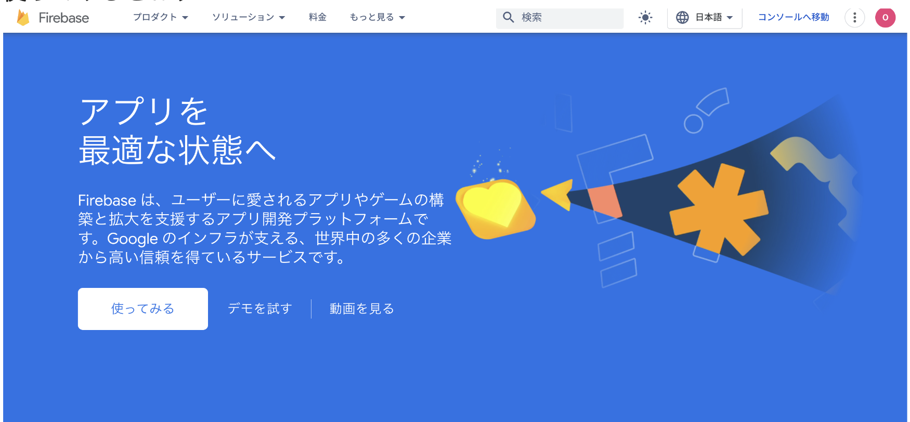
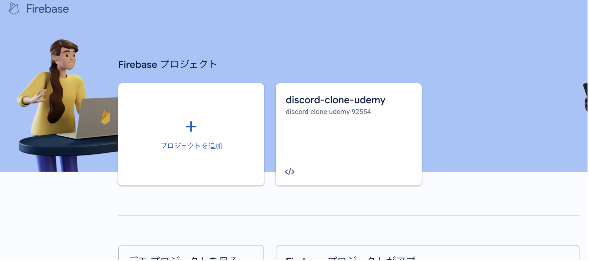
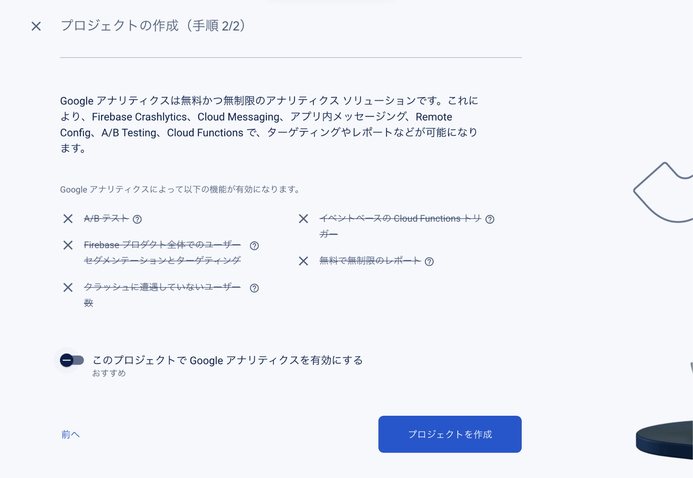
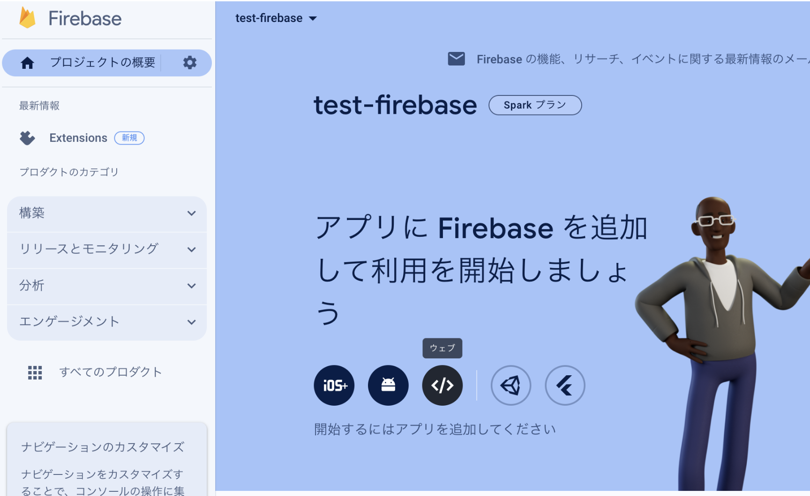
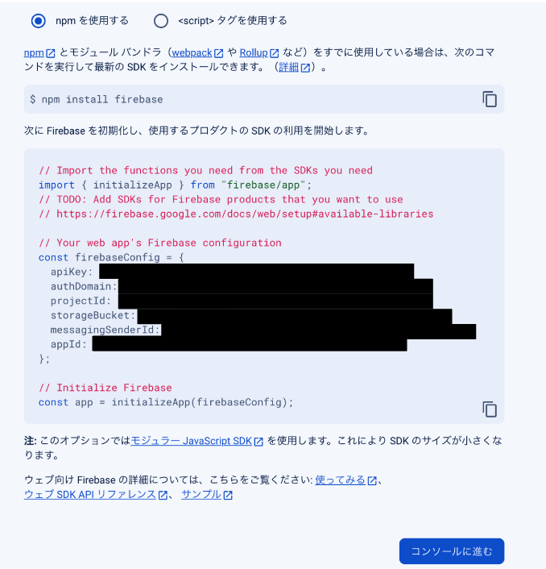
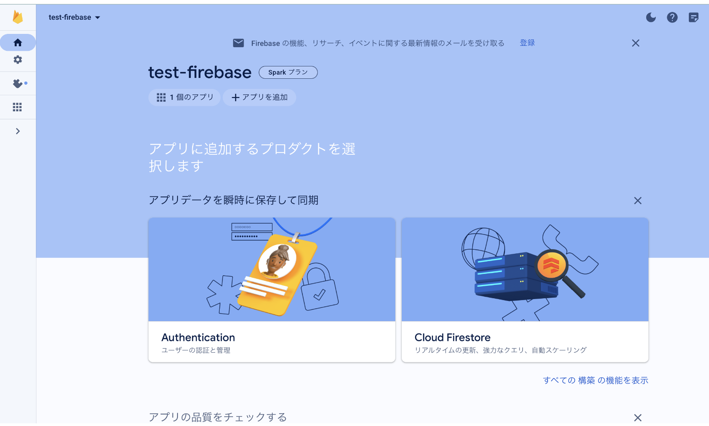
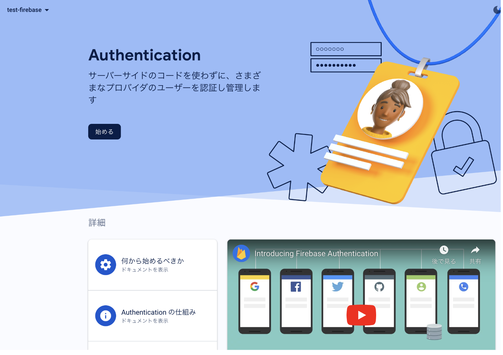
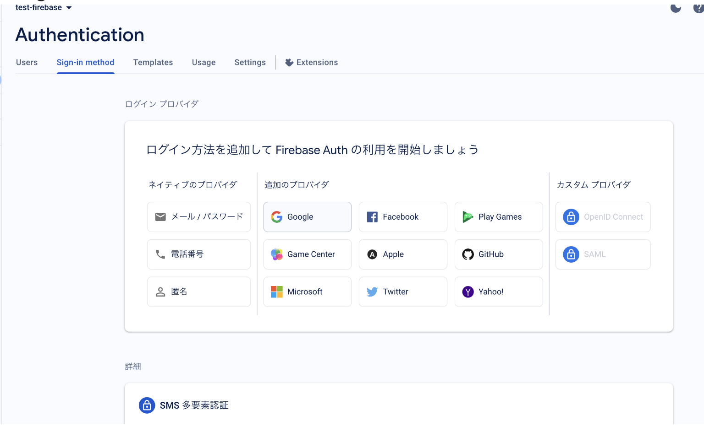
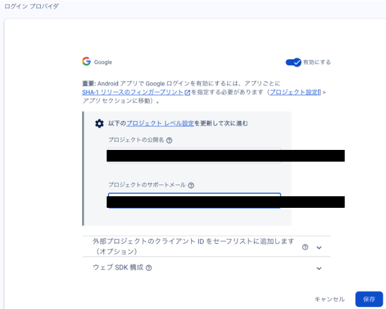
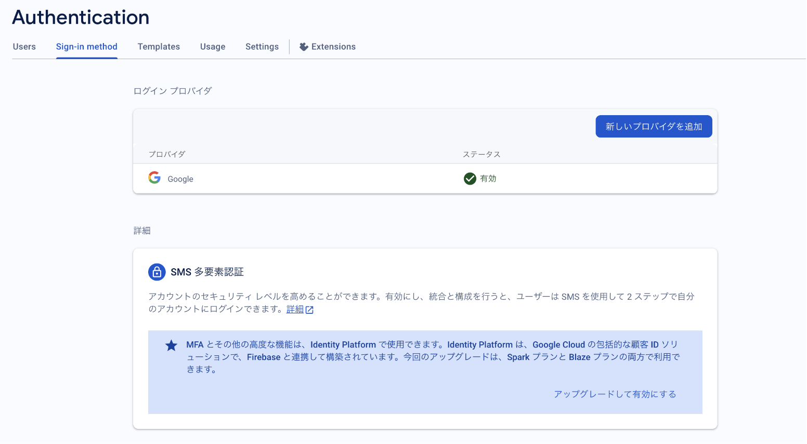

# FirebaseでのGoogleログイン

目次

- [Firebaseでの認証登録](#Firebaseでの認証登録)
- [コード例](#コード例)

- [参考](#参考)

# Firebaseでの認証登録

 1. 使ってみるを押下

 2. 「プロジェクトを追加」を押下

 3. アナリティクスの要否をチェック（使わないなら不要）

 4. Webボタン(<>)を押下してアプリを登録

 5. 下記のSDKについてはあとでコンソールで確認可能

 6. コンソール内でAuthentificationをクリック

 7. 始めるボタンを押下

 8. お好みのプロバイダーを選定

 9. トグルボタンを押下して有効化

 10. 下記の画面でステータスが有効になっていたらOK

# コード例

# 参考
- [Firebaseログイン画面](https://firebase.google.com/?hl=ja)
- [Firebaseドキュメント](https://firebase.google.com/docs/auth?hl=ja)
